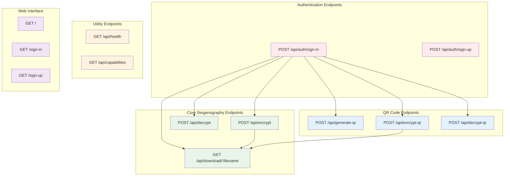
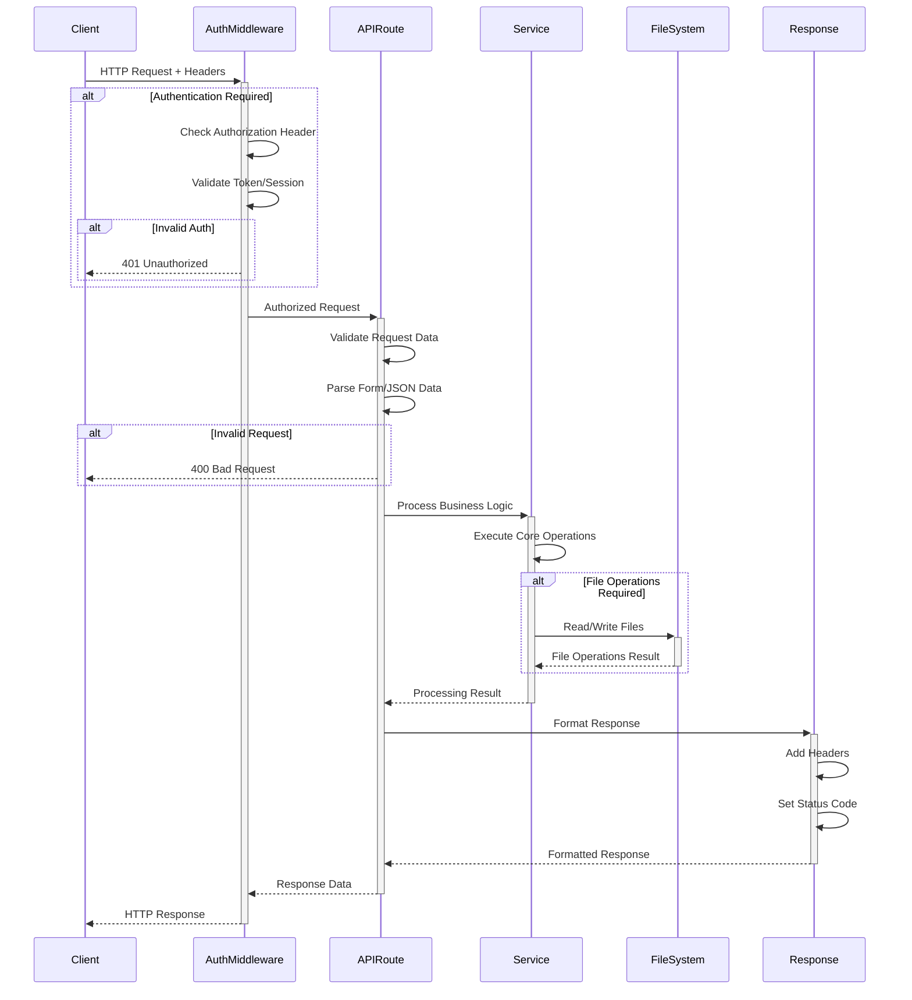
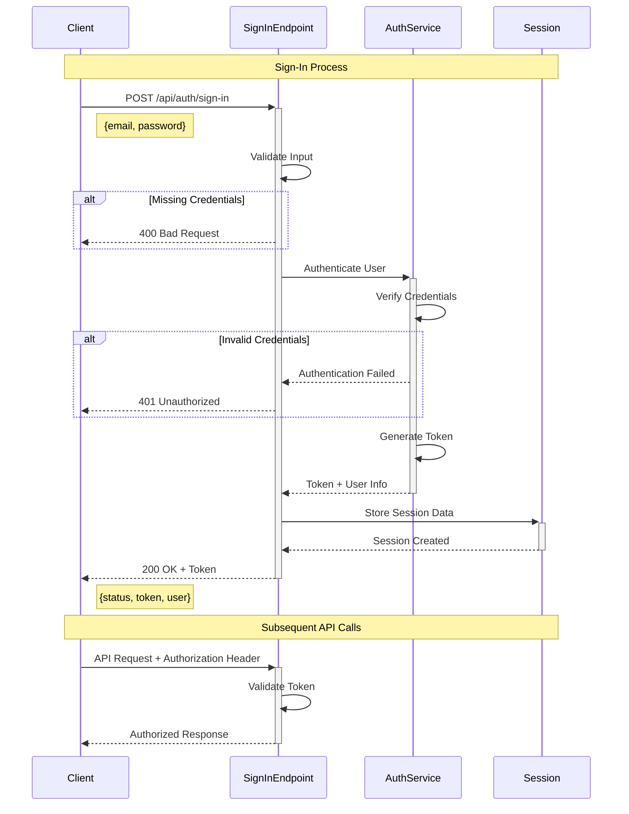
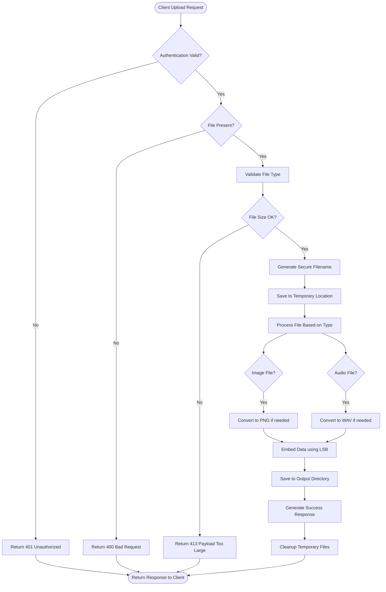
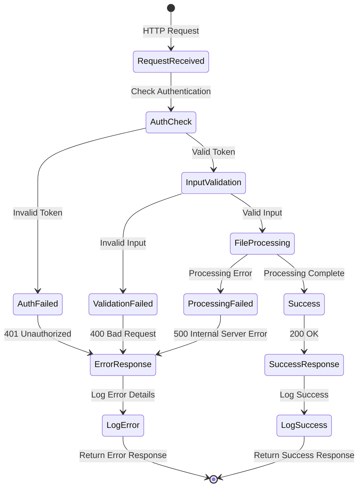
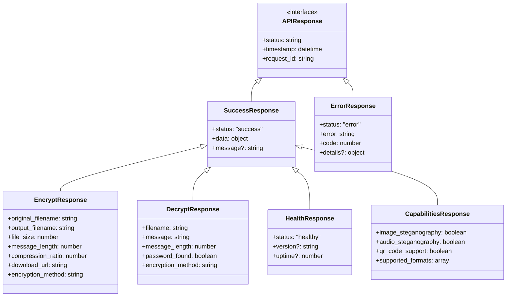
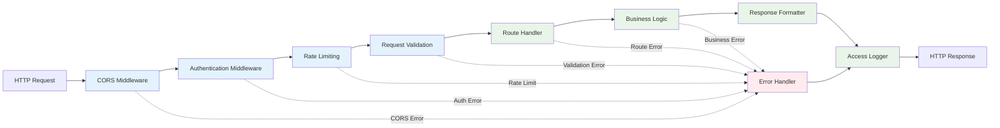
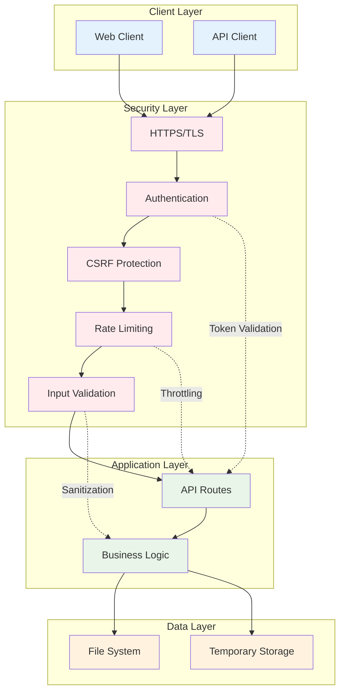

 # API Architecture Diagrams

This document provides detailed UML diagrams for the API layer of the steganography system.

## 1. API Endpoint Overview

## 2. Request/Response Flow Diagram

## 3. Authentication Flow Diagram

## 4. File Upload and Processing Flow

## 5. Error Handling Flow

## 6. API Response Structure Diagram

## 7. Middleware Chain Diagram

## 8. API Security Model

## API Endpoint Details

### Core Endpoints

| Endpoint | Method | Purpose | Authentication |
|----------|--------|---------|----------------|
| `/api/health` | GET | Health check | No |
| `/api/capabilities` | GET | Get system capabilities | No |
| `/api/encrypt` | POST | Encrypt and hide message | Yes |
| `/api/decrypt` | POST | Extract and decrypt message | Yes |
| `/api/download/:filename` | GET | Download processed file | Yes |

### QR Code Endpoints

| Endpoint | Method | Purpose | Authentication |
|----------|--------|---------|----------------|
| `/api/generate-qr` | POST | Generate QR code | Yes |
| `/api/encrypt-qr` | POST | Create encrypted QR code | Yes |
| `/api/decrypt-qr` | POST | Decrypt QR code message | Yes |

### Authentication Endpoints

| Endpoint | Method | Purpose | Authentication |
|----------|--------|---------|----------------|
| `/api/auth/sign-in` | POST | User authentication | No |
| `/api/auth/sign-up` | POST | User registration | No |

### Response Codes

- **200 OK**: Successful operation
- **400 Bad Request**: Invalid input or missing parameters
- **401 Unauthorized**: Authentication required or invalid
- **413 Payload Too Large**: File size exceeds limit
- **500 Internal Server Error**: Server processing error