# Comprehensive UML Diagrams - Steganography System

This document contains all major UML diagram types for the steganography system using proper Mermaid.js syntax.

## 1. Use Case Diagrams

### Primary Use Cases

```mermaid
graph TB
    subgraph "Steganography System"
        UC1[Encrypt Message in Image]
        UC2[Decrypt Message from Image]
        UC3[Encrypt Message in Audio]
        UC4[Decrypt Message from Audio]
        UC5[Generate QR Code]
        UC6[Encrypt Message in QR Code]
        UC7[Decrypt Message from QR Code]
        UC8[Auto-Generate Password]
        UC9[Manage File Uploads]
        UC10[Download Processed Files]
        UC11[User Authentication]
        UC12[View System Capabilities]
    end
    
    subgraph "Actors"
        User[End User]
        Developer[Developer]
        Admin[Administrator]
        APIClient[API Client]
    end
    
    %% User interactions
    User --> UC1
    User --> UC2
    User --> UC3
    User --> UC4
    User --> UC5
    User --> UC6
    User --> UC7
    User --> UC8
    User --> UC9
    User --> UC10
    User --> UC11
    
    %% Developer interactions
    Developer --> UC12
    Developer --> UC1
    Developer --> UC2
    
    %% API Client interactions
    APIClient --> UC1
    APIClient --> UC2
    APIClient --> UC6
    APIClient --> UC7
    APIClient --> UC12
    
    %% Admin interactions
    Admin --> UC11
    Admin --> UC12
    
    %% Include relationships
    UC1 -.->|includes| UC8
    UC3 -.->|includes| UC8
    UC6 -.->|includes| UC8
    UC1 -.->|includes| UC9
    UC3 -.->|includes| UC9
    UC6 -.->|includes| UC9
    UC1 -.->|includes| UC10
    UC3 -.->|includes| UC10
    UC6 -.->|includes| UC10
    
    %% Extend relationships
    UC2 -.->|extends| UC11
    UC4 -.->|extends| UC11
    UC7 -.->|extends| UC11
```

### Authentication Use Cases

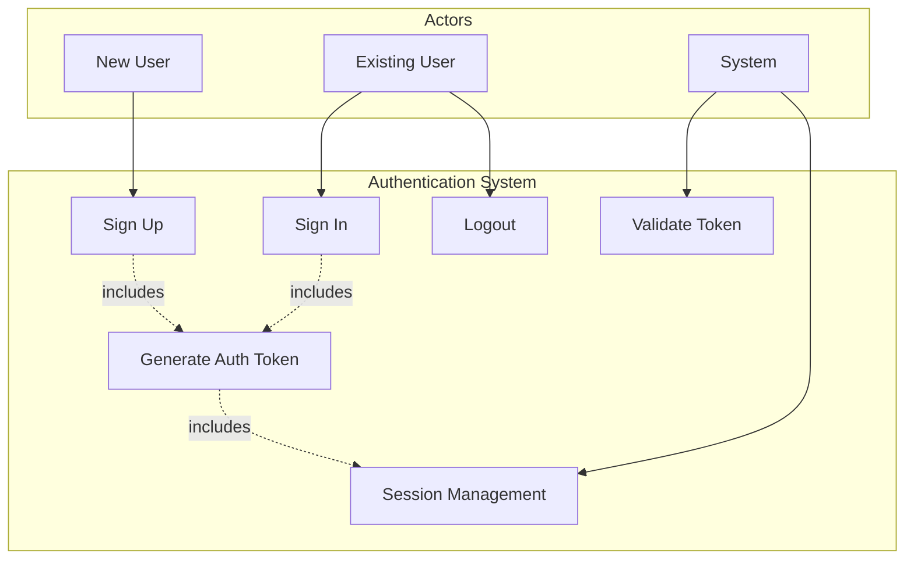

## 2. Object Diagrams

### Encryption Process Objects

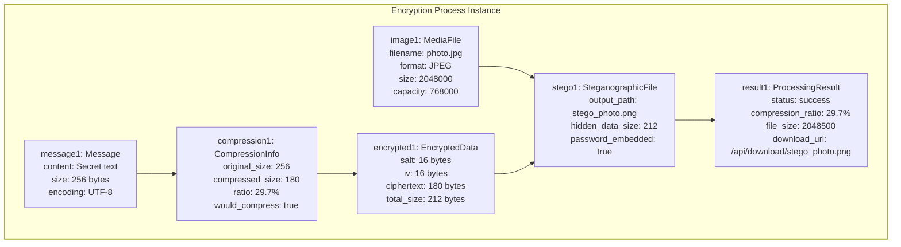

### QR Code Process Objects

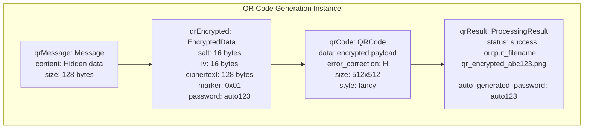

## 3. Package and Class Diagrams

### Package Diagram

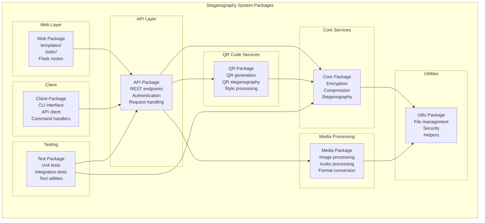

### Detailed Class Diagram

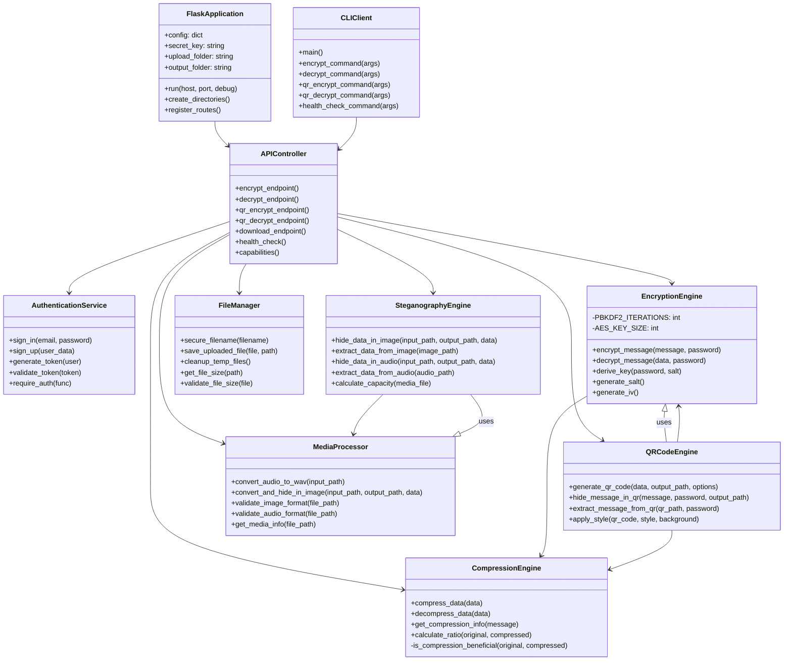

## 4. Component Diagram

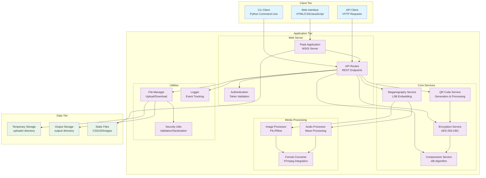

## 5. Deployment Diagram

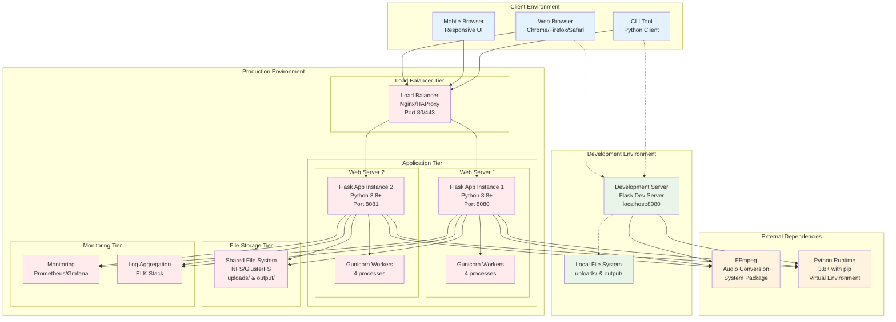

## 6. Activity Diagram

### Message Encryption Activity

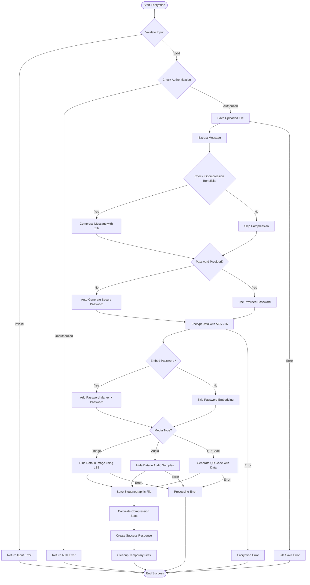

### Message Decryption Activity

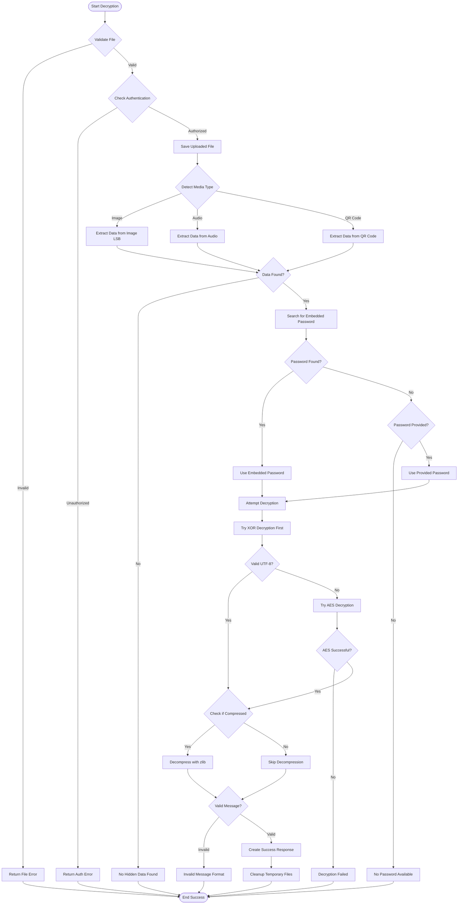

## 7. Sequence Diagram

### Complete Encryption Sequence

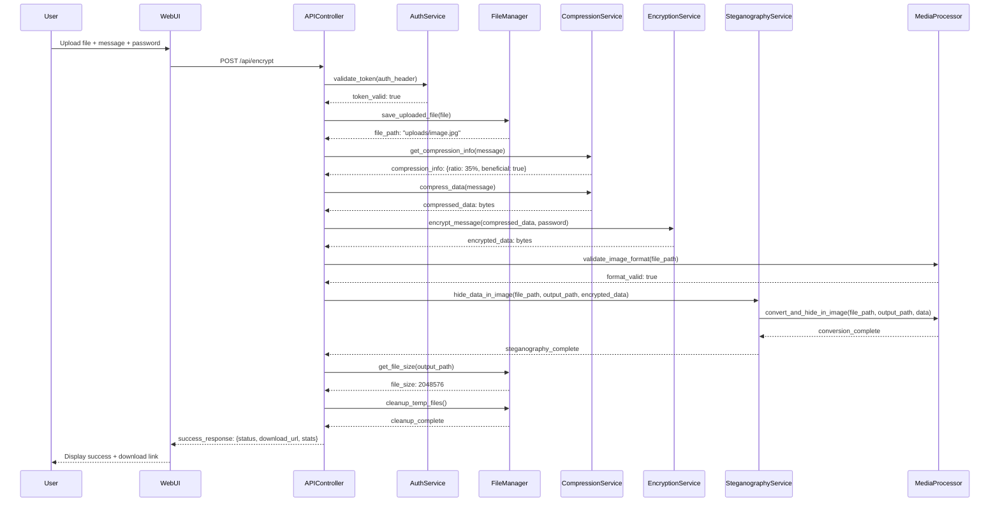

### Authentication Sequence

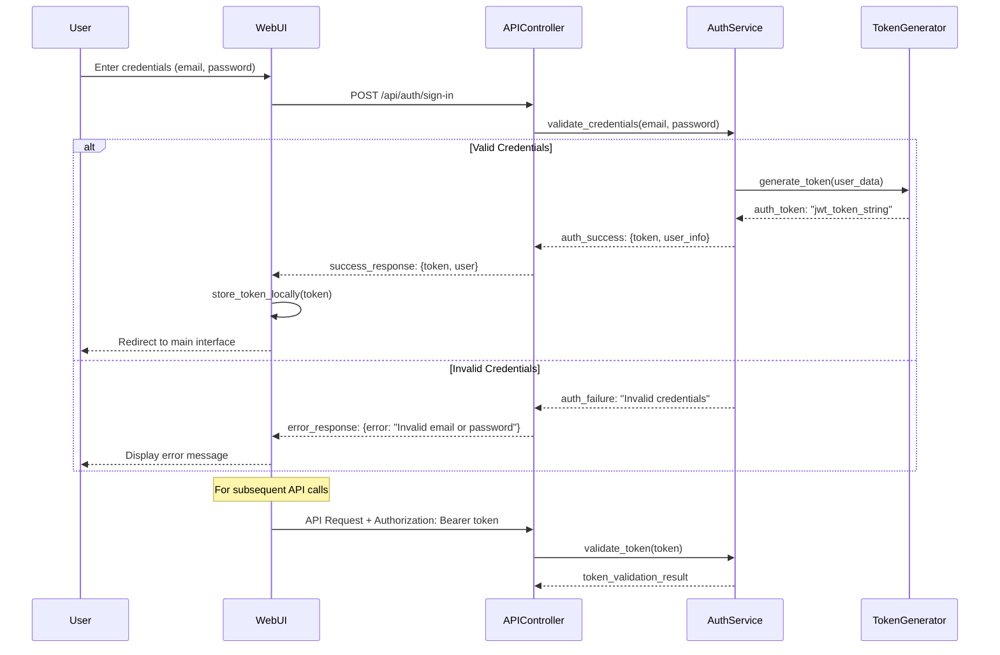

### QR Code Generation Sequence

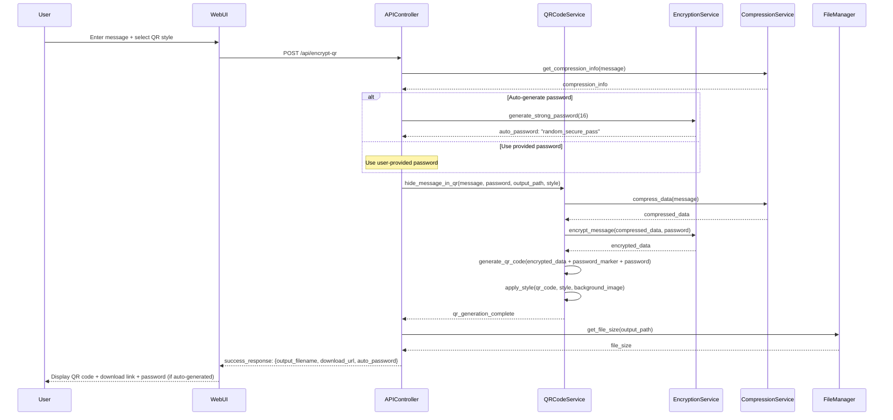

## 8. State Transition Diagram

### File Processing State Machine

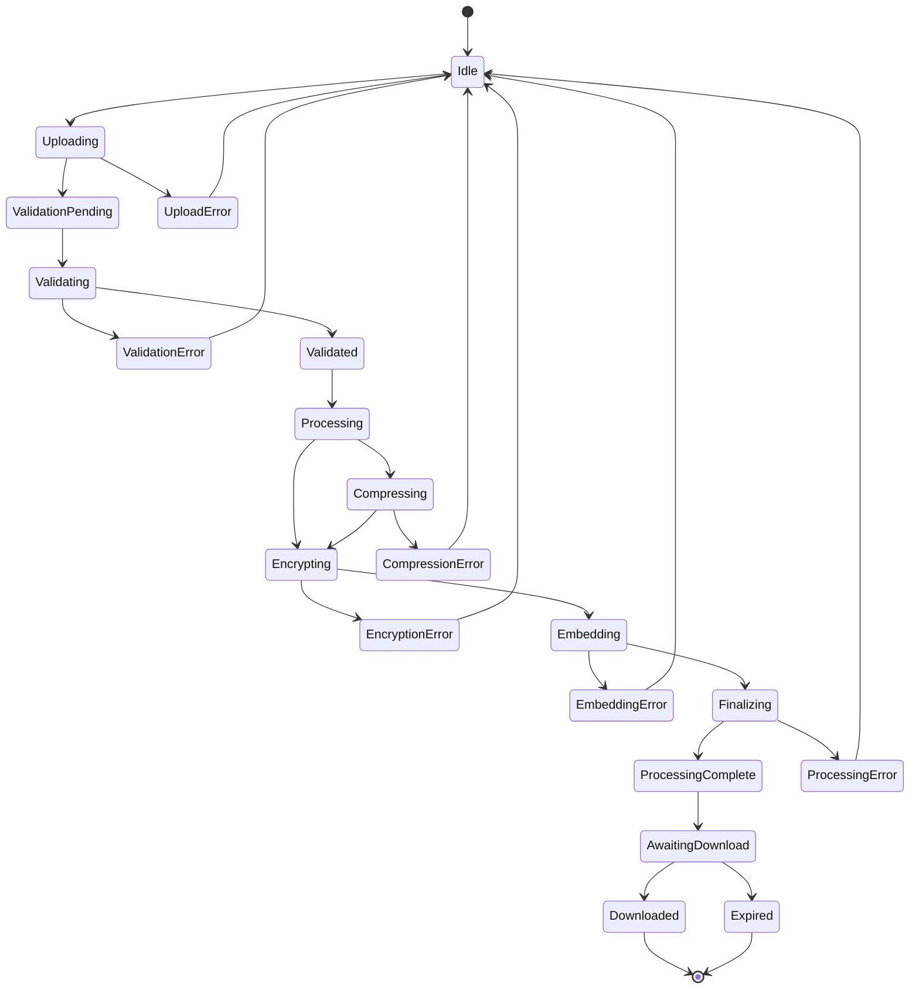

### User Session State Machine

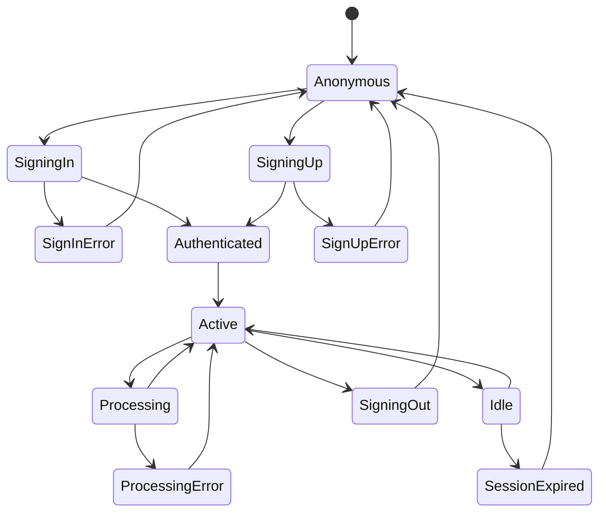

### QR Code Processing State Machine

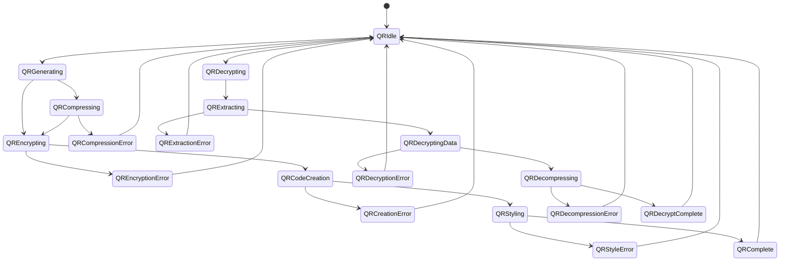

---

## Diagram Usage Guidelines

### Mermaid.js Syntax Notes
- All diagrams use proper Mermaid.js syntax compatible with GitHub and modern documentation platforms
- Relationship arrows follow Mermaid standards: `-->`, `-.->`, `==>`
- State diagrams use `stateDiagram-v2` for enhanced features
- Class diagrams use proper inheritance (`<|--`) and composition (`*--`) notation
- Sequence diagrams include proper participant definitions and message flows
- Object diagrams avoid HTML tags and use multi-line text format
- State descriptions removed to prevent parsing errors

### Customization Options
- Colors and styling can be applied using Mermaid themes
- Diagrams can be rendered in various formats (SVG, PNG, PDF)
- Interactive features available in supported platforms
- Responsive design for different screen sizes

### Integration
- All diagrams are designed to work together as a comprehensive system view
- Cross-references between diagrams maintain consistency
- Suitable for technical documentation, presentations, and system analysis 