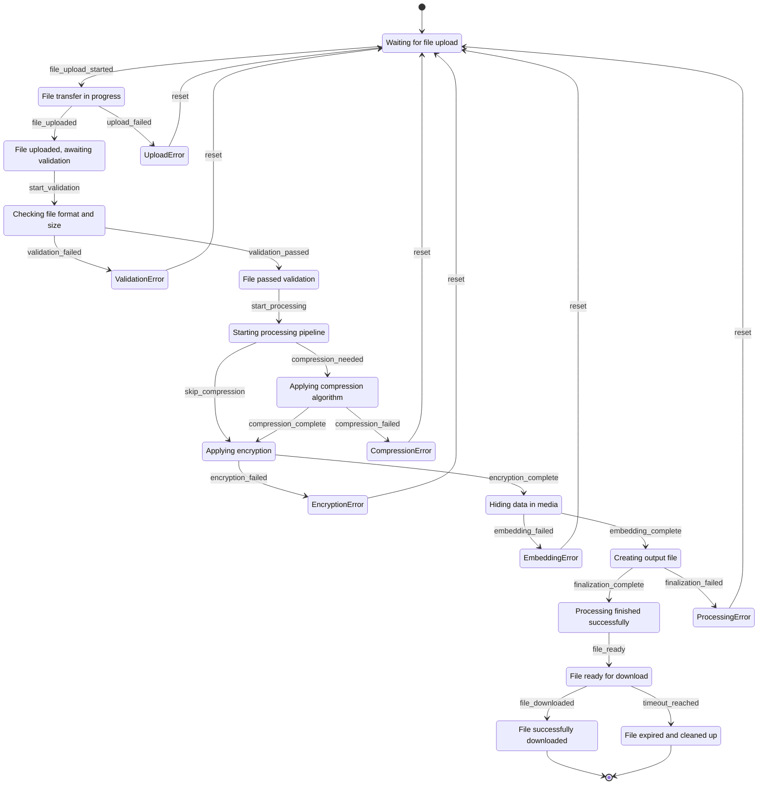
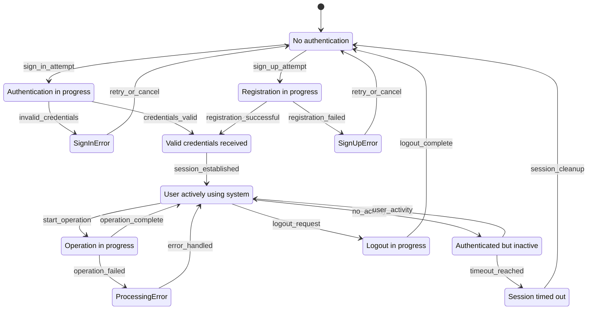
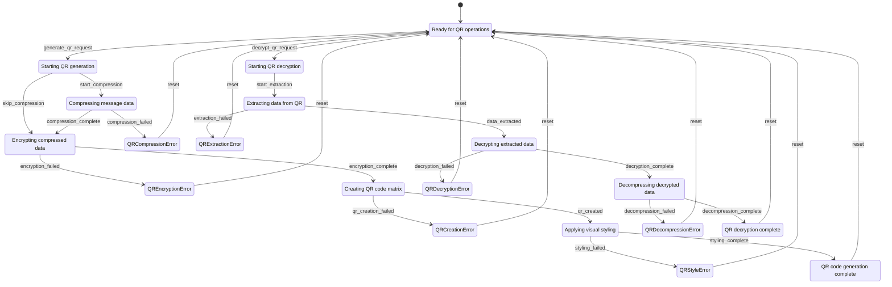

# Comprehensive UML Diagrams - Steganography System

This document contains all major UML diagram types for the steganography system using proper Mermaid.js syntax.

## 1. Use Case Diagrams

### Primary Use Cases

```mermaid
graph TB
    subgraph "Steganography System"
        UC1[Encrypt Message in Image]
        UC2[Decrypt Message from Image]
        UC3[Encrypt Message in Audio]
        UC4[Decrypt Message from Audio]
        UC5[Generate QR Code]
        UC6[Encrypt Message in QR Code]
        UC7[Decrypt Message from QR Code]
        UC8[Auto-Generate Password]
        UC9[Manage File Uploads]
        UC10[Download Processed Files]
        UC11[User Authentication]
        UC12[View System Capabilities]
    end
    
    subgraph "Actors"
        User[👤 End User]
        Developer[👨‍💻 Developer]
        Admin[👨‍💼 Administrator]
        APIClient[🤖 API Client]
    end
    
    %% User interactions
    User --> UC1
    User --> UC2
    User --> UC3
    User --> UC4
    User --> UC5
    User --> UC6
    User --> UC7
    User --> UC8
    User --> UC9
    User --> UC10
    User --> UC11
    
    %% Developer interactions
    Developer --> UC12
    Developer --> UC1
    Developer --> UC2
    
    %% API Client interactions
    APIClient --> UC1
    APIClient --> UC2
    APIClient --> UC6
    APIClient --> UC7
    APIClient --> UC12
    
    %% Admin interactions
    Admin --> UC11
    Admin --> UC12
    
    %% Include relationships
    UC1 -.->|includes| UC8
    UC3 -.->|includes| UC8
    UC6 -.->|includes| UC8
    UC1 -.->|includes| UC9
    UC3 -.->|includes| UC9
    UC6 -.->|includes| UC9
    UC1 -.->|includes| UC10
    UC3 -.->|includes| UC10
    UC6 -.->|includes| UC10
    
    %% Extend relationships
    UC2 -.->|extends| UC11
    UC4 -.->|extends| UC11
    UC7 -.->|extends| UC11
```



### Authentication Use Cases

```mermaid
graph TB
    subgraph "Authentication System"
        UC_AUTH1[Sign In]
        UC_AUTH2[Sign Up]
        UC_AUTH3[Generate Auth Token]
        UC_AUTH4[Validate Token]
        UC_AUTH5[Logout]
        UC_AUTH6[Session Management]
    end
    
    subgraph "Actors"
        NewUser[👤 New User]
        ExistingUser[👤 Existing User]
        System[🖥️ System]
    end
    
    NewUser --> UC_AUTH2
    ExistingUser --> UC_AUTH1
    ExistingUser --> UC_AUTH5
    
    UC_AUTH1 -.->|includes| UC_AUTH3
    UC_AUTH2 -.->|includes| UC_AUTH3
    UC_AUTH3 -.->|includes| UC_AUTH6
    
    System --> UC_AUTH4
    System --> UC_AUTH6
```



## 2. Object Diagrams

### Encryption Process Objects

```mermaid
graph TB
    subgraph "Encryption Process Instance"
        msg1[message1: Message<br/>content: "Secret text"<br/>size: 256 bytes<br/>encoding: "UTF-8"]
        
        comp1[compression1: CompressionInfo<br/>original_size: 256<br/>compressed_size: 180<br/>ratio: 29.7%<br/>would_compress: true]
        
        enc1[encrypted1: EncryptedData<br/>salt: [16 bytes]<br/>iv: [16 bytes]<br/>ciphertext: [180 bytes]<br/>total_size: 212 bytes]
        
        file1[image1: MediaFile<br/>filename: "photo.jpg"<br/>format: "JPEG"<br/>size: 2048000<br/>capacity: 768000]
        
        stego1[stego1: SteganographicFile<br/>output_path: "stego_photo.png"<br/>hidden_data_size: 212<br/>password_embedded: true]
        
        result1[result1: ProcessingResult<br/>status: "success"<br/>compression_ratio: 29.7%<br/>file_size: 2048500<br/>download_url: "/api/download/stego_photo.png"]
    end
    
    msg1 --> comp1
    comp1 --> enc1
    file1 --> stego1
    enc1 --> stego1
    stego1 --> result1
```

### QR Code Process Objects

```mermaid
graph TB
    subgraph "QR Code Generation Instance"
        qr_msg[qrMessage: Message<br/>content: "Hidden data"<br/>size: 128 bytes]
        
        qr_enc[qrEncrypted: EncryptedData<br/>salt: [16 bytes]<br/>iv: [16 bytes]<br/>ciphertext: [128 bytes]<br/>marker: 0x01<br/>password: "auto123"]
        
        qr_code[qrCode: QRCode<br/>data: [encrypted payload]<br/>error_correction: "H"<br/>size: 512x512<br/>style: "fancy"]
        
        qr_result[qrResult: ProcessingResult<br/>status: "success"<br/>output_filename: "qr_encrypted_abc123.png"<br/>auto_generated_password: "auto123"]
    end
    
    qr_msg --> qr_enc
    qr_enc --> qr_code
    qr_code --> qr_result
```

## 3. Package and Class Diagrams

### Package Diagram

```mermaid
graph TB
    subgraph "Steganography System Packages"
        subgraph "Web Layer"
            WebPkg[📦 web<br/>- templates/<br/>- static/<br/>- Flask routes]
        end
        
        subgraph "API Layer"
            APIPkg[📦 api<br/>- REST endpoints<br/>- Authentication<br/>- Request handling]
        end
        
        subgraph "Core Services"
            CorePkg[📦 core<br/>- Encryption<br/>- Compression<br/>- Steganography]
        end
        
        subgraph "Media Processing"
            MediaPkg[📦 media<br/>- Image processing<br/>- Audio processing<br/>- Format conversion]
        end
        
        subgraph "QR Code Services"
            QRPkg[📦 qr<br/>- QR generation<br/>- QR steganography<br/>- Style processing]
        end
        
        subgraph "Utilities"
            UtilsPkg[📦 utils<br/>- File management<br/>- Security<br/>- Helpers]
        end
        
        subgraph "Client"
            ClientPkg[📦 client<br/>- CLI interface<br/>- API client<br/>- Command handlers]
        end
        
        subgraph "Testing"
            TestPkg[📦 tests<br/>- Unit tests<br/>- Integration tests<br/>- Test utilities]
        end
    end
    
    WebPkg --> APIPkg
    APIPkg --> CorePkg
    APIPkg --> MediaPkg
    APIPkg --> QRPkg
    CorePkg --> UtilsPkg
    MediaPkg --> UtilsPkg
    QRPkg --> CorePkg
    ClientPkg --> APIPkg
    TestPkg --> CorePkg
    TestPkg --> APIPkg
```



### Detailed Class Diagram


## 4. Component Diagram

```mermaid
graph TB
    subgraph "Client Tier"
        WebUI[🌐 Web Interface<br/>HTML/CSS/JavaScript]
        CLI[💻 CLI Client<br/>Python Command Line]
        APIClient[🔌 API Client<br/>HTTP Requests]
    end
    
    subgraph "Application Tier"
        subgraph "Web Server"
            Flask[🌶️ Flask Application<br/>WSGI Server]
            Routes[🛣️ API Routes<br/>REST Endpoints]
            Auth[🔐 Authentication<br/>Token Validation]
        end
        
        subgraph "Core Services"
            EncryptSvc[🔒 Encryption Service<br/>AES-256-CBC]
            CompressSvc[📦 Compression Service<br/>zlib Algorithm]
            StegoSvc[🖼️ Steganography Service<br/>LSB Embedding]
            QRSvc[📱 QR Code Service<br/>Generation & Processing]
        end
        
        subgraph "Media Processing"
            ImageProc[🖼️ Image Processor<br/>PIL/Pillow]
            AudioProc[🎵 Audio Processor<br/>Wave Processing]
            Converter[🔄 Format Converter<br/>FFmpeg Integration]
        end
        
        subgraph "Utilities"
            FileManager[📁 File Manager<br/>Upload/Download]
            Security[🛡️ Security Utils<br/>Validation/Sanitization]
            Logger[📝 Logger<br/>Event Tracking]
        end
    end
    
    subgraph "Data Tier"
        TempStorage[💾 Temporary Storage<br/>uploads/ directory]
        OutputStorage[📤 Output Storage<br/>output/ directory]
        StaticFiles[📄 Static Files<br/>CSS/JS/Images]
    end
    
    %% Client connections
    WebUI --> Flask
    CLI --> Routes
    APIClient --> Routes
    
    %% Internal connections
    Flask --> Routes
    Routes --> Auth
    Routes --> EncryptSvc
    Routes --> CompressSvc
    Routes --> StegoSvc
    Routes --> QRSvc
    Routes --> FileManager
    
    %% Service dependencies
    EncryptSvc --> CompressSvc
    StegoSvc --> ImageProc
    StegoSvc --> AudioProc
    QRSvc --> EncryptSvc
    ImageProc --> Converter
    AudioProc --> Converter
    
    %% Utility connections
    FileManager --> Security
    Routes --> Logger
    FileManager --> TempStorage
    FileManager --> OutputStorage
    Flask --> StaticFiles
    
    %% Styling
    classDef client fill:#e1f5fe
    classDef app fill:#f3e5f5
    classDef data fill:#e8f5e8
    
    class WebUI,CLI,APIClient client
    class Flask,Routes,Auth,EncryptSvc,CompressSvc,StegoSvc,QRSvc,ImageProc,AudioProc,Converter,FileManager,Security,Logger app
    class TempStorage,OutputStorage,StaticFiles data
```



## 5. Deployment Diagram

```mermaid
graph TB
    subgraph "Production Environment"
        subgraph "Load Balancer Tier"
            LB[⚖️ Load Balancer<br/>Nginx/HAProxy<br/>Port 80/443]
        end
        
        subgraph "Application Tier"
            subgraph "Web Server 1"
                App1[🌶️ Flask App Instance 1<br/>Python 3.8+<br/>Port 8080]
                Worker1[👷 Gunicorn Workers<br/>4 processes]
            end
            
            subgraph "Web Server 2"
                App2[🌶️ Flask App Instance 2<br/>Python 3.8+<br/>Port 8081]
                Worker2[👷 Gunicorn Workers<br/>4 processes]
            end
        end
        
        subgraph "File Storage Tier"
            SharedFS[📁 Shared File System<br/>NFS/GlusterFS<br/>uploads/ & output/]
        end
        
        subgraph "Monitoring Tier"
            Monitor[📊 Monitoring<br/>Prometheus/Grafana]
            Logs[📝 Log Aggregation<br/>ELK Stack]
        end
    end
    
    subgraph "Development Environment"
        DevServer[💻 Development Server<br/>Flask Dev Server<br/>localhost:8080]
        LocalFS[📁 Local File System<br/>uploads/ & output/]
    end
    
    subgraph "Client Environment"
        Browser[🌐 Web Browser<br/>Chrome/Firefox/Safari]
        CLITool[💻 CLI Tool<br/>Python Client]
        Mobile[📱 Mobile Browser<br/>Responsive UI]
    end
    
    subgraph "External Dependencies"
        FFmpeg[🎬 FFmpeg<br/>Audio Conversion<br/>System Package]
        Python[🐍 Python Runtime<br/>3.8+ with pip<br/>Virtual Environment]
    end
    
    %% Production connections
    Browser --> LB
    Mobile --> LB
    CLITool --> LB
    
    LB --> App1
    LB --> App2
    
    App1 --> Worker1
    App2 --> Worker2
    
    App1 --> SharedFS
    App2 --> SharedFS
    
    App1 --> Monitor
    App2 --> Monitor
    App1 --> Logs
    App2 --> Logs
    
    %% Development connections
    Browser -.-> DevServer
    CLITool -.-> DevServer
    DevServer -.-> LocalFS
    
    %% Dependencies
    App1 --> FFmpeg
    App2 --> FFmpeg
    App1 --> Python
    App2 --> Python
    DevServer --> FFmpeg
    DevServer --> Python
    
    %% Styling
    classDef prod fill:#ffebee
    classDef dev fill:#e8f5e8
    classDef client fill:#e3f2fd
    classDef external fill:#fff3e0
    
    class LB,App1,App2,Worker1,Worker2,SharedFS,Monitor,Logs prod
    class DevServer,LocalFS dev
    class Browser,CLITool,Mobile client
    class FFmpeg,Python external
```



## 6. Activity Diagram

### Message Encryption Activity


### Message Decryption Activity


## 7. Sequence Diagram

### Complete Encryption Sequence


### Authentication Sequence


### QR Code Generation Sequence


## 8. State Transition Diagram

### File Processing State Machine



### User Session State Machine



### QR Code Processing State Machine



---

## Diagram Usage Guidelines

### Mermaid.js Syntax Notes
- All diagrams use proper Mermaid.js syntax compatible with GitHub and modern documentation platforms
- Relationship arrows follow Mermaid standards: `-->`, `-.->`, `==>`
- State diagrams use `stateDiagram-v2` for enhanced features
- Class diagrams use proper inheritance (`<|--`) and composition (`*--`) notation
- Sequence diagrams include proper participant definitions and message flows

### Customization Options
- Colors and styling can be applied using Mermaid themes
- Diagrams can be rendered in various formats (SVG, PNG, PDF)
- Interactive features available in supported platforms
- Responsive design for different screen sizes

### Integration
- All diagrams are designed to work together as a comprehensive system view
- Cross-references between diagrams maintain consistency
- Suitable for technical documentation, presentations, and system analysis 