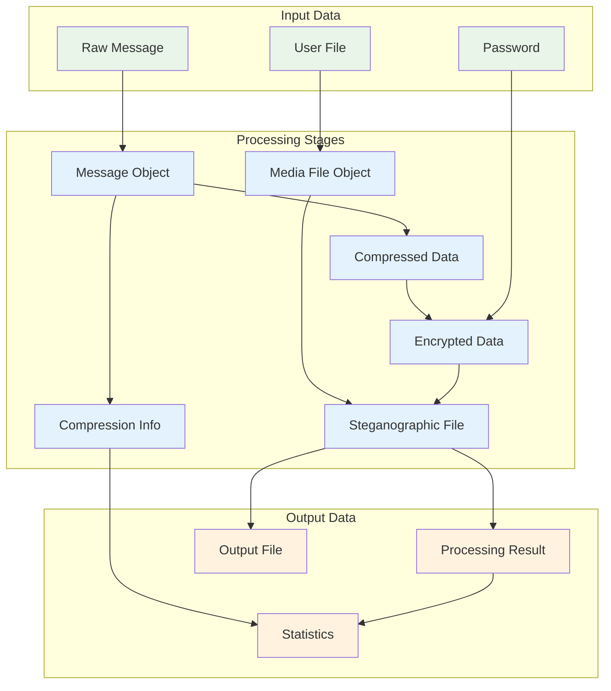
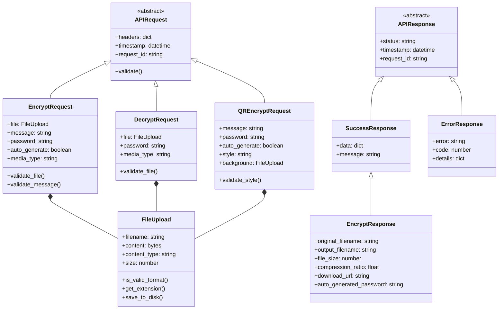
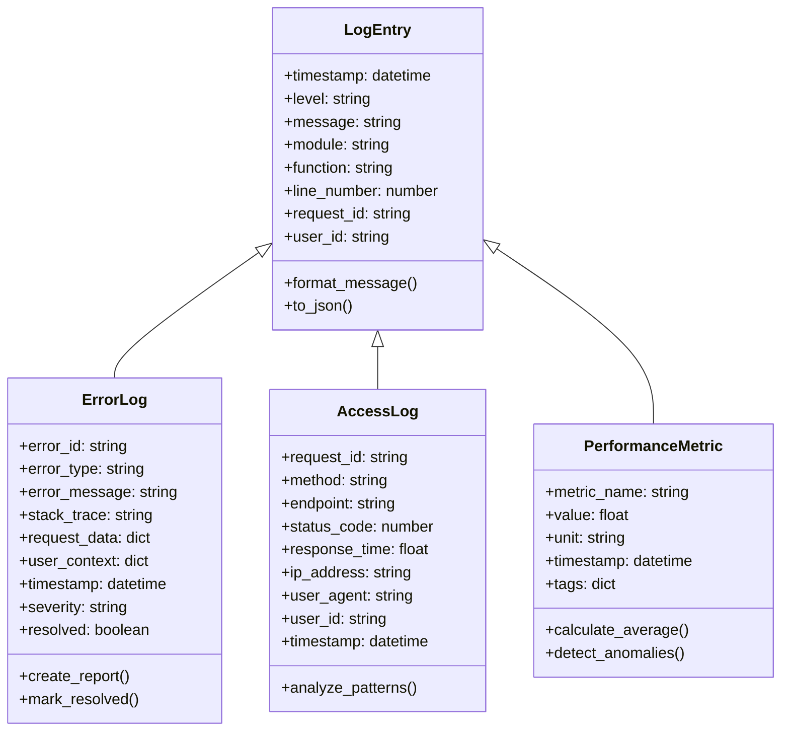

# Data Models and Structures

This document provides UML diagrams for data models and structures used in the steganography system.

## 1. Core Data Models

```mermaid
classDiagram
    class Message {
        +content: string
        +size: number
        +encoding: string
        +checksum: string
        +validate()
        +encode()
        +decode()
    }
    
    class EncryptedData {
        +salt: bytes[16]
        +iv: bytes[16]
        +compression_marker: bytes[1]
        +ciphertext: bytes
        +total_size: number
        +is_compressed: boolean
        +get_overhead_size()
        +extract_components()
    }
    
    class CompressionInfo {
        +original_size: number
        +compressed_size: number
        +compression_ratio: float
        +would_compress: boolean
        +algorithm: string
        +calculate_ratio()
        +is_beneficial()
    }
    
    class MediaFile {
        +filename: string
        +path: string
        +size: number
        +format: string
        +dimensions: tuple
        +capacity: number
        +validate_format()
        +calculate_capacity()
        +get_metadata()
    }
    
    class SteganographicFile {
        +original_file: MediaFile
        +output_file: MediaFile
        +hidden_data: EncryptedData
        +embedding_method: string
        +password_embedded: boolean
        +create_output()
        +verify_integrity()
    }
    
    class ProcessingResult {
        +status: string
        +original_filename: string
        +output_filename: string
        +file_size: number
        +message_length: number
        +compression_info: CompressionInfo
        +encryption_method: string
        +download_url: string
        +timestamp: datetime
    }
    
    %% Relationships
    Message ||--|| EncryptedData : encrypts_to
    EncryptedData ||--|| CompressionInfo : contains
    MediaFile ||--|| SteganographicFile : becomes
    SteganographicFile ||--|| EncryptedData : contains
    SteganographicFile ||--|| ProcessingResult : produces
    Message ||--|| CompressionInfo : analyzed_by
```

## 2. File Processing Data Flow



## 3. API Request/Response Data Models



## 4. Configuration and Settings Model

```mermaid
classDiagram
    class AppConfig {
        +upload_folder: string
        +output_folder: string
        +max_content_length: number
        +secret_key: string
        +debug: boolean
        +host: string
        +port: number
        +validate_config()
        +create_directories()
    }
    
    class SecurityConfig {
        +token_expiry: number
        +max_file_size: number
        +allowed_extensions: list
        +rate_limit: number
        +cors_origins: list
        +validate_security()
    }
    
    class ProcessingConfig {
        +compression_level: number
        +encryption_algorithm: string
        +key_derivation_iterations: number
        +supported_image_formats: list
        +supported_audio_formats: list
        +ffmpeg_path: string
        +validate_processing()
    }
    
    class SystemCapabilities {
        +image_steganography: boolean
        +audio_steganography: boolean
        +qr_code_support: boolean
        +audio_conversion: boolean
        +image_conversion: boolean
        +ffmpeg_available: boolean
        +detect_capabilities()
        +update_status()
    }
    
    %% Relationships
    AppConfig ||--|| SecurityConfig : includes
    AppConfig ||--|| ProcessingConfig : includes
    ProcessingConfig ||--|| SystemCapabilities : determines
```

## 5. Session and Authentication Model

```mermaid
classDiagram
    class User {
        +email: string
        +name: string
        +password_hash: string
        +created_at: datetime
        +last_login: datetime
        +is_active: boolean
        +validate_email()
        +check_password()
        +update_last_login()
    }
    
    class Session {
        +session_id: string
        +user_id: string
        +token: string
        +created_at: datetime
        +expires_at: datetime
        +is_active: boolean
        +ip_address: string
        +user_agent: string
        +is_valid()
        +extend_session()
        +invalidate()
    }
    
    class AuthToken {
        +token: string
        +user_id: string
        +issued_at: datetime
        +expires_at: datetime
        +scope: list
        +is_expired()
        +validate()
        +refresh()
    }
    
    class Permission {
        +name: string
        +description: string
        +resource: string
        +action: string
    }
    
    class UserPermission {
        +user_id: string
        +permission_id: string
        +granted_at: datetime
        +granted_by: string
    }
    
    %% Relationships
    User ||--o{ Session : has
    User ||--|| AuthToken : authenticated_by
    User ||--o{ UserPermission : has
    Permission ||--o{ UserPermission : granted_in
    Session ||--|| AuthToken : contains
```

## 6. File System Data Model

```mermaid
classDiagram
    class FileSystemManager {
        +upload_dir: string
        +output_dir: string
        +temp_dir: string
        +max_file_size: number
        +cleanup_interval: number
        +create_directories()
        +cleanup_old_files()
        +get_available_space()
    }
    
    class UploadedFile {
        +original_name: string
        +secure_name: string
        +path: string
        +size: number
        +mime_type: string
        +upload_time: datetime
        +checksum: string
        +move_to_temp()
        +validate_integrity()
        +cleanup()
    }
    
    class ProcessedFile {
        +input_file: UploadedFile
        +output_path: string
        +processing_time: datetime
        +file_size: number
        +processing_duration: float
        +status: string
        +error_message: string
        +create_download_link()
        +schedule_cleanup()
    }
    
    class TempFile {
        +path: string
        +created_at: datetime
        +expires_at: datetime
        +purpose: string
        +is_expired()
        +extend_lifetime()
        +delete()
    }
    
    class DownloadLink {
        +file_path: string
        +token: string
        +created_at: datetime
        +expires_at: datetime
        +download_count: number
        +max_downloads: number
        +is_valid()
        +increment_count()
        +generate_url()
    }
    
    %% Relationships
    FileSystemManager ||--o{ UploadedFile : manages
    FileSystemManager ||--o{ ProcessedFile : manages
    FileSystemManager ||--o{ TempFile : manages
    UploadedFile ||--|| ProcessedFile : becomes
    ProcessedFile ||--|| DownloadLink : accessible_via
    TempFile ||--o{ UploadedFile : temporary_storage
```

## 7. Error and Logging Model



## Data Validation Rules

### Message Validation
- **Content**: Non-empty string, max 1MB
- **Encoding**: UTF-8 compatible
- **Special Characters**: Allowed and preserved

### File Validation
- **Size**: Max 64MB per file
- **Format**: Supported image/audio formats only
- **Content**: Valid file headers and structure

### Password Validation
- **Length**: 8-128 characters
- **Complexity**: Optional strength requirements
- **Auto-generation**: 16-character secure random

### API Request Validation
- **Headers**: Required authentication headers
- **Content-Type**: Multipart/form-data for file uploads
- **Rate Limiting**: Max requests per minute per IP

## Data Security Measures

1. **Encryption**: AES-256-CBC for message encryption
2. **Key Derivation**: PBKDF2 with 100,000 iterations
3. **File Security**: Secure filename generation
4. **Session Management**: Token-based authentication
5. **Data Cleanup**: Automatic temporary file removal 