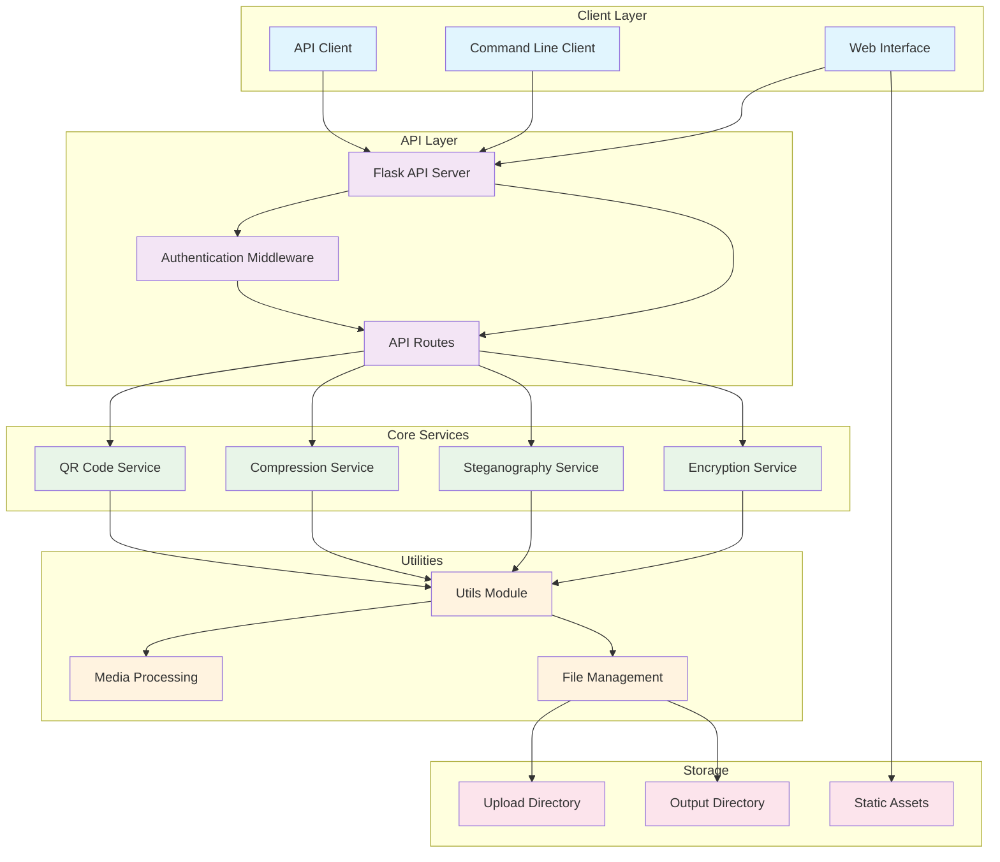
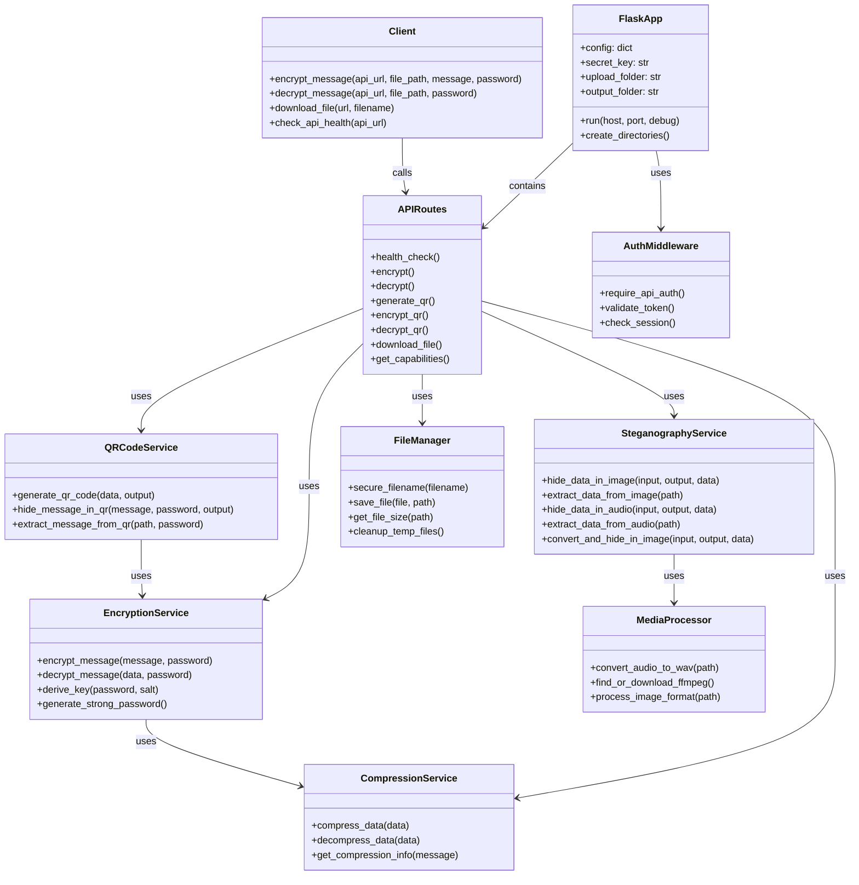
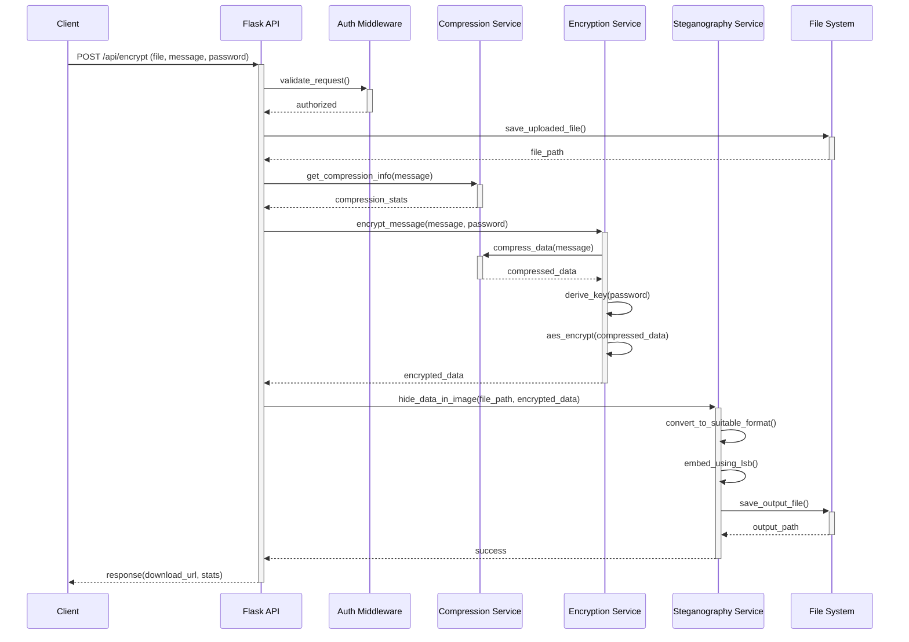
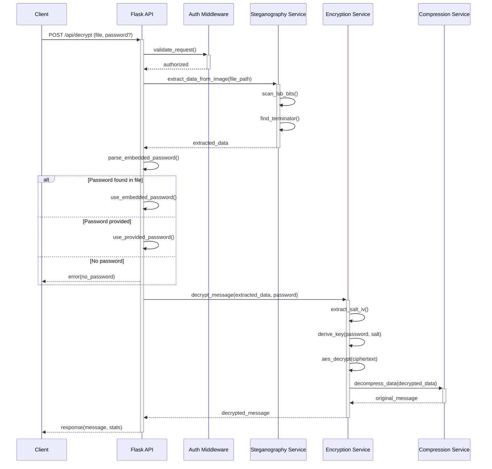
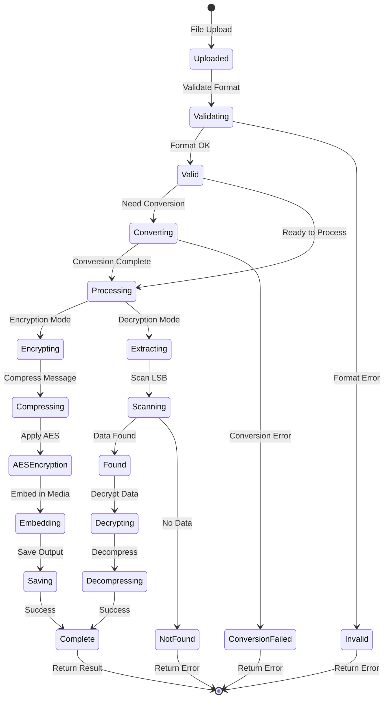
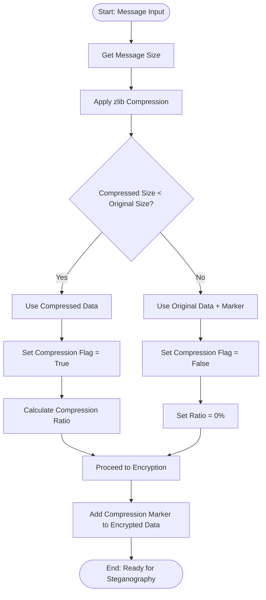
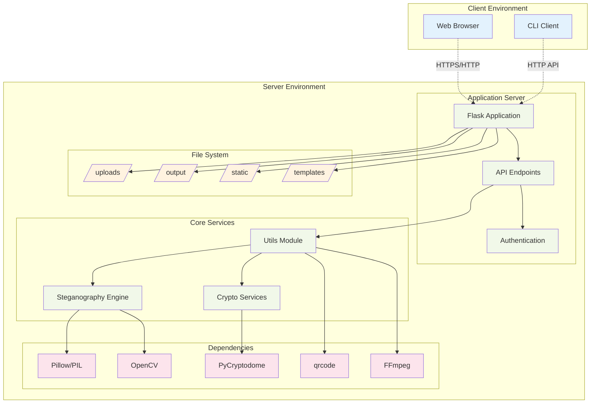
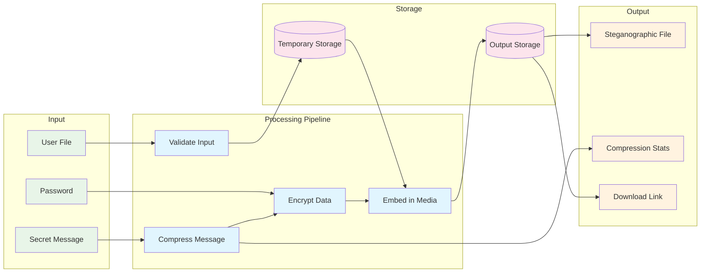

 # System Architecture Documentation

This document provides comprehensive UML diagrams describing the steganography system architecture using Mermaid.js.

## 1. System Overview - Component Diagram

## 2. Class Diagram - Core Components

## 3. Sequence Diagram - Encryption Process

## 4. Sequence Diagram - Decryption Process

## 5. State Diagram - File Processing States

## 6. Activity Diagram - Compression Decision Flow

## 7. Deployment Diagram

## 8. Data Flow Diagram

## Architecture Summary

The steganography system follows a layered architecture with clear separation of concerns:

1. **Presentation Layer**: Web interface and CLI client
2. **API Layer**: Flask-based REST API with authentication
3. **Service Layer**: Core business logic (encryption, compression, steganography)
4. **Utility Layer**: Helper functions and media processing
5. **Storage Layer**: File management and temporary storage

Key design patterns implemented:
- **MVC Pattern**: Separation of routes, business logic, and data
- **Service Pattern**: Encapsulated business logic in service classes
- **Middleware Pattern**: Authentication and request processing
- **Factory Pattern**: Dynamic service instantiation based on media type
- **Strategy Pattern**: Different encryption strategies based on message size